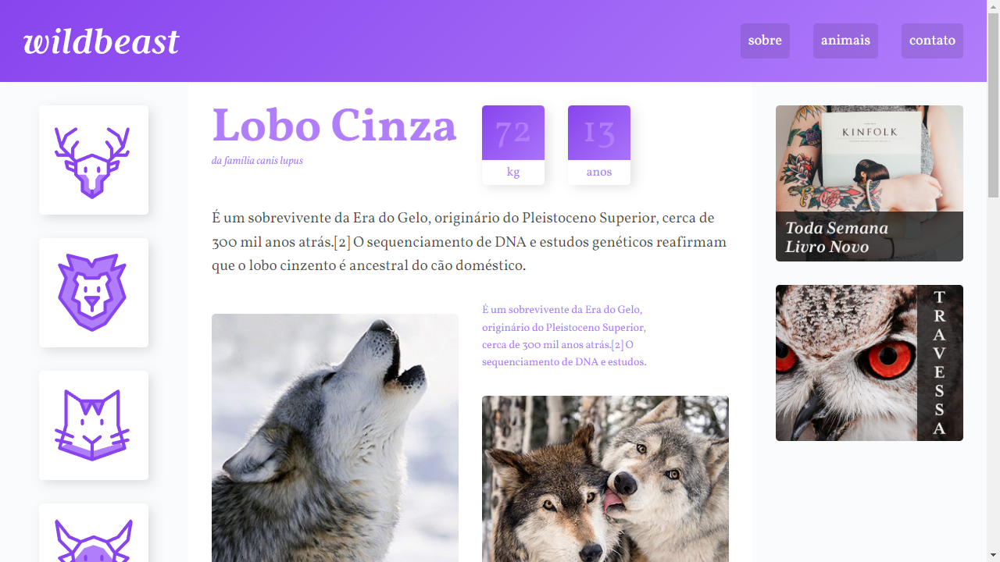

# Wildbeast - Origamid

Projeto desenvolvido no curso da Origamid.

Para abrir em nova aba: 
- segure a tecla "Ctrl" e clique com botão esquerdo do mouse, ou;
- clique com o botão de "scroll" do mouse.

🔗 [Clique aqui para visualizar e interagir com o meu projeto.](https://guilhermeemanuell.github.io/wildbeast-origamid/)

## 🛠 Tecnologias

- HTML
- CSS
- Git e Github

## ✉ Contato

emanuellguilherme@gmail.com
